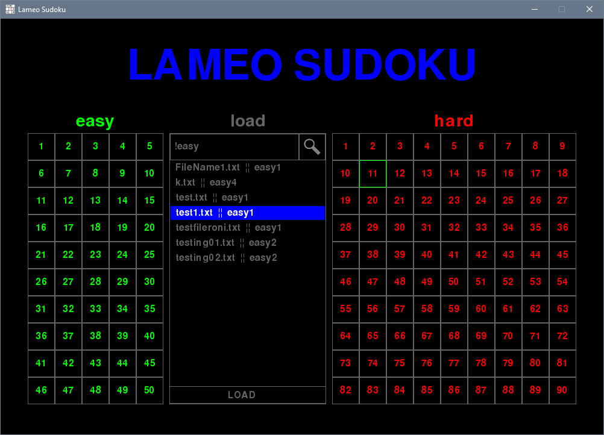
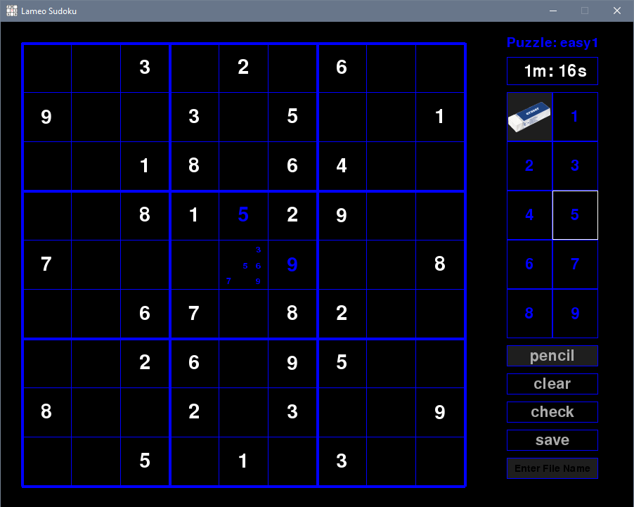

# Sudoku-Windows
My first programming project - a simple sudoku game for windows written in a single ~1400 line, messy python script.
Running the program will create a savefile folder in the same directory as the script.

Requirements:
- 1000 x 690 minimum screen resolution.
- Python: https://www.python.org/downloads/
- The pygame library: https://www.pygame.org/wiki/GettingStarted.
- The images and textfiles in this repository.

Screenshots from the game:

Choose from Easy puzzles 1-50, Hard puzzles 1-90, or Saved puzzle states using a search term. Search !easy or !hard to display the first 10 of that difficulty puzzle in the savefile folder. Non textfiles in the save folder are not shown, and textfiles with the wrong data format (give an error on load attempt) are not loaded.

Game loads starting values and any saved data (values, timer, puzzle number) if loading a file. Includes buttons for standard functions: integers to set values 1-9, pencil for writing potential values which are hidden (but saved) once a value is set, eraser to clear either type of value, clear to remove all values, savefile textbox and button to save the current data given a file name, and check to determine if the puzzle is solved correctly or not (click grid to remove resulting message immediately). Timer only coded to work properly up to 1 hour, file names only up to 12 characters long (Unicode U+0020 -> U+007F).

